# Machin-Learning-note
於2021/1/13至2021/1/28 撰寫&學習此處的所有程式碼

於2021/4/29上傳至此

# 此機器學習筆記內容除了「為了方便理解所加的中文註解與少部分程式碼」之外皆非我自創，大部分內容來自Python machine learning 3 edition 一書

接下來的範例皆以"Anderson's Iris data set“為資料輸入

## Perceptron classifier

為一簡單的神經元線性分類器，下圖為其分類效果

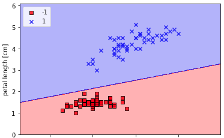

## Adaline classifier

為Perceptron classifier的改進

使用批次梯度下降(batch gradient descent)為收斂方式

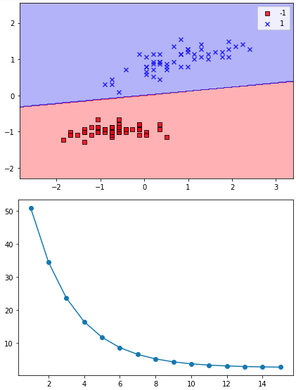

在Adaline classifier的基礎上採用隨機梯度下降(stochastic gradient descent)

可見收斂效率快速增長

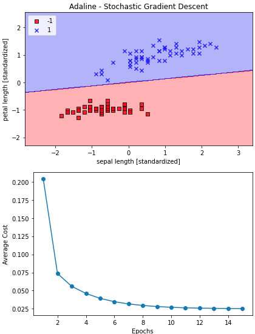

## LogisticRegression

在展現決策邊界之後，採用LogisticRegression分類器的多元分類功能

決策邊界圖

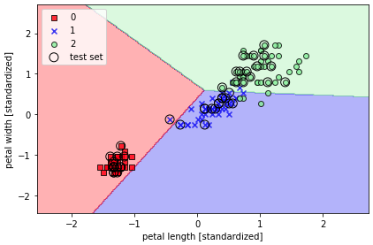

LogisticRegression視覺化

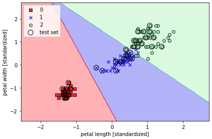

正規化的影響

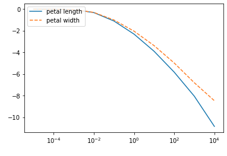

## SVM

下方展示SVM在不同資料集與不同參數下的呈現
此圖展示其於鳶尾花資料集的一般分類

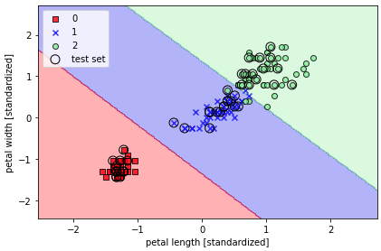

此圖展現其於亂數資料集的非線性分類

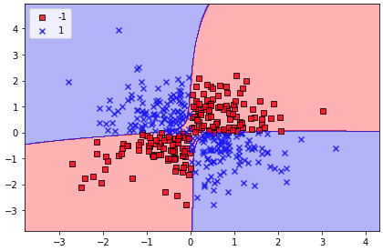

下兩圖為不同的gamma對SVM分類效果的影響

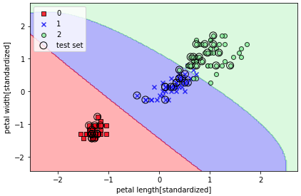

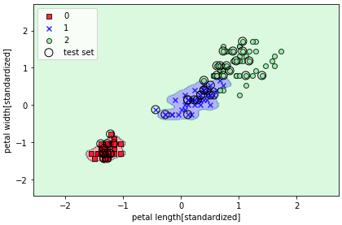

## Decision tree

下方展示決策樹的基本分類性能

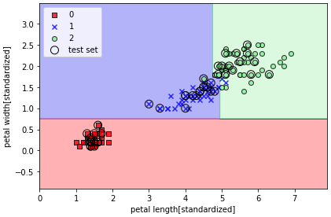

